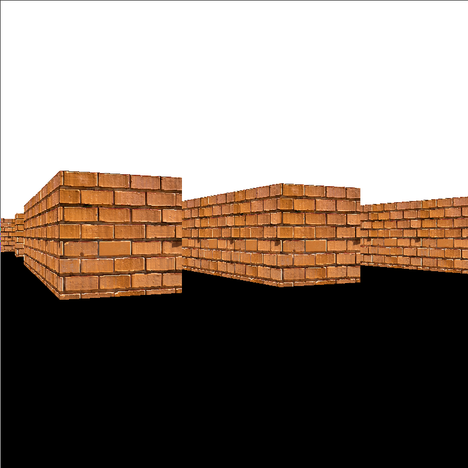

# Raycasting demo
Very rough implementation of the raycasting algorithm for rendering 3d-looking scenes fast based on a 2d map.
## Screenshot

## Theory
The speed increase compared to 1-iteration raytracing comes from the fact that the intersection calculations are only calculated in 2d.
This means that the we only need to cast `SCREEN_W` rays (one for each column of pixels) compared to the raytracing case when you have to cast
`SCREEN_WxSCREEN_H` rays (one for each pixel on the screen).

The drawback of this (and it is a big one) is that you can only draw cylinders (in the mathematical sense) oriented along the z-axis (up).

## Future plan
 - Textures
 - Implement a simple rasterization version and compare speed
 - Optimization
